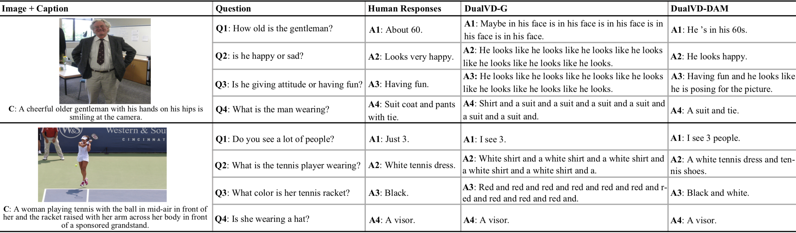

DAM: Deliberation, Abandon and Memory Networks for Generating Detailed and Non-repetitive Responses in Visual Dialogue
====================================



<p align="center">The responses generated by DualVD-DAM.</p>


The PyTorch implementation for “DAM: Deliberation, Abandon and Memory Networks for Generating Detailed and Non-repetitive Responses in Visual Dialogue” (IJCAI2020) will be released soon.

If you use this code in your research, please consider citing:

```text
@inproceedings{jiang2020dam,
  title =  {DAM: Deliberation, Abandon and Memory Networks for Generating Detailed and Non-repetitive Responses in Visual Dialogue},
  author =  {Jiang, Xiaoze and Yu, Jing and Sun, Yajing and Qin, Zengchang and Zhu, Zihao and Hu, Yue and Wu, Qi},
  year =  {2020},
  booktitle = {IJCAI}
}
```


